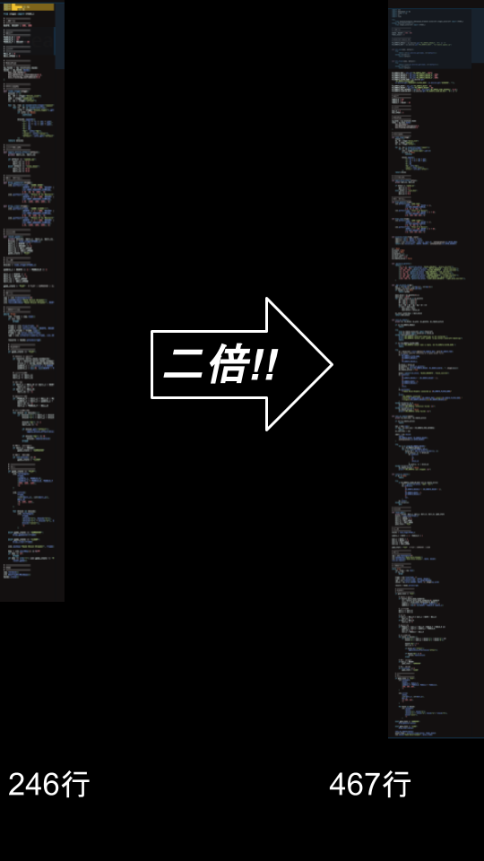

# IT Kids 卒業発表
## 9期生6番 奥山詩温

---

# 目的
「MINECRAFTに映し出すためのプログラムをもっと簡単に作りたい」

---

# 問題点

  <!-- 1番目：文字と画像を同時に出現させるグループ -->
  

    
インベーダーゲームができた！

    <!-- ここにインベーダーゲームの画像を入れます -->
    
  

  <!-- 2番目：クロス（バツ印）の画像（2回目のクリックで出現） -->
  

---

### **コードを書き直さなければならない！**

 

---

 # 時間の無駄

---

一度作ったものをそのままMinecraftに表示できないのか？

---

# mcremote-projector

---

# できること

---

# 実演

---

# 今後
minecraft向けのAPI以外にも生活が楽になるものを作る。

---

